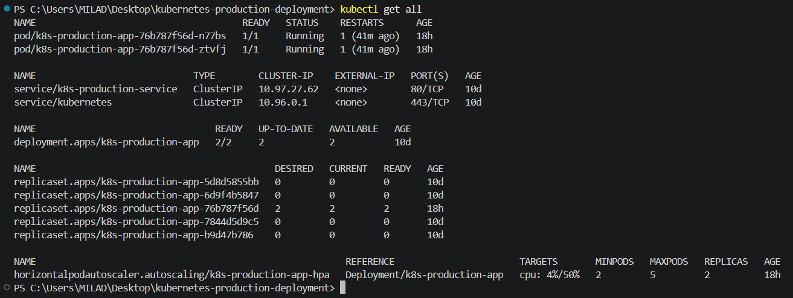
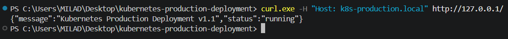
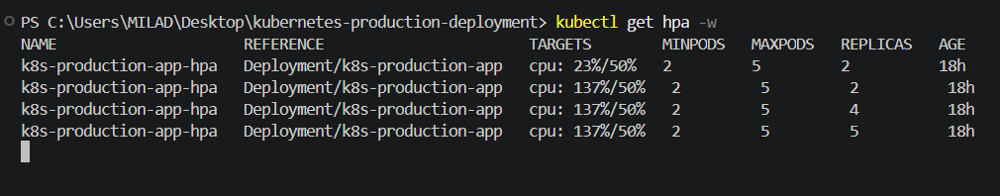
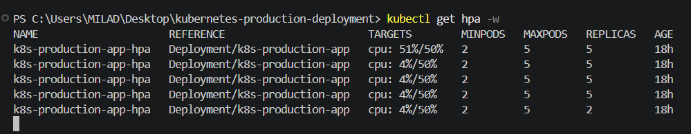
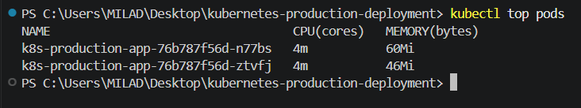

# Kubernetes Production Deployment

A production-style Kubernetes deployment project built to demonstrate practical Kubernetes skills including application deployment, service networking, ingress routing, configuration management, health checks, rolling updates, rollback, and horizontal pod autoscaling.

This project is part of a DevOps portfolio focused on Junior DevOps Engineer, Remote, and International opportunities.

---

## Project Overview

This repository deploys a FastAPI application to Kubernetes using Minikube.

The project includes:

- Kubernetes Deployment
- ClusterIP Service
- NGINX Ingress
- ConfigMap
- Kubernetes Secret
- Readiness Probe
- Liveness Probe
- Rolling Update
- Rollback
- Horizontal Pod Autoscaler
- CPU and Memory Requests/Limits
- Metrics Server integration
- Load-based Scaling Validation

---

## Application

The application is a lightweight FastAPI service.

**Current application version:** `v1.1`

**Main endpoint:** `/`

Example response:

```json
{
  "message": "Kubernetes Production Deployment v1.1",
  "status": "running"
}
```

**Health endpoint:** `/health`

Example response:

```json
{
  "status": "healthy"
}
```

---

## Architecture

```text
Client
  |
  v
NGINX Ingress
  |
  v
Kubernetes Service
  |
  v
Kubernetes Deployment
  |
  v
Application Pods
```

Supporting components:

```text
ConfigMap ------\
                 \
Secret ----------> Application Pods

Metrics Server
      |
      v
Horizontal Pod Autoscaler
      |
      v
Deployment Replicas
```

For more details, see [`docs/architecture.md`](docs/architecture.md).

---

## Repository Structure

```text
kubernetes-production-deployment/
├── app/
│   ├── Dockerfile
│   ├── main.py
│   └── requirements.txt
├── docs/
│   └── architecture.md
├── k8s/
│   ├── configmap.yaml
│   ├── deployment.yaml
│   ├── hpa.yaml
│   ├── ingress.yaml
│   ├── secret.example.yaml
│   ├── secret.yaml
│   └── service.yaml
├── screenshots/
│   ├── 01-kubernetes-resources.png
│   ├── 02-ingress-validation.png
│   ├── 03-hpa-scale-up.png
│   ├── 04-hpa-scale-down.png
│   └── 05-metrics-server.png
├── .gitignore
└── README.md
```

`k8s/secret.yaml` contains the local secret configuration and is intentionally excluded from Git.

Only the safe example file is committed:

`k8s/secret.example.yaml`

---

## Kubernetes Deployment

Deployment name: `k8s-production-app`

Default replicas: `2`

Container image: `k8s-production-app:1.1`

Deployment strategy: `RollingUpdate`

---

## Resource Requests and Limits

```yaml
resources:
  requests:
    cpu: "100m"
    memory: "128Mi"
  limits:
    cpu: "500m"
    memory: "256Mi"
```

These values provide the resource baseline required for CPU-based Horizontal Pod Autoscaling.

---

## Kubernetes Service

Service name: `k8s-production-service`

Service type: `ClusterIP`

Service port: `80`

Target port: `8000`

Internal service connectivity was validated successfully.

---

## NGINX Ingress

Ingress name: `k8s-production-ingress`

Host: `k8s-production.local`

Ingress class: `nginx`

The complete routing flow was validated:

```text
Client
  |
Ingress
  |
Service
  |
Pods
```

On this Windows + Minikube environment, `minikube tunnel` is used for local ingress access.

Validation command:

```powershell
curl.exe -H "Host: k8s-production.local" http://127.0.0.1/
```

Verified response:

```json
{
  "message": "Kubernetes Production Deployment v1.1",
  "status": "running"
}
```

---

## ConfigMap

ConfigMap name: `k8s-production-config`

Current variables:

```text
APP_NAME=Kubernetes Production Deployment
APP_ENV=production
```

The variables are injected into the application Pods using `envFrom`.

Injection was verified inside a running container.

---

## Kubernetes Secret

Secret name: `k8s-production-secret`

Secret type: `Opaque`

The local secret file is excluded from Git:

`k8s/secret.yaml`

A safe example is provided:

`k8s/secret.example.yaml`

Secret injection into the running Pods was verified without exposing the real value.

---

## Health Checks

### Readiness Probe

```text
HTTP GET /health
Port: 8000
Initial Delay: 5 seconds
Period: 10 seconds
Timeout: 2 seconds
Failure Threshold: 3
```

### Liveness Probe

```text
HTTP GET /health
Port: 8000
Initial Delay: 10 seconds
Period: 15 seconds
Timeout: 2 seconds
Failure Threshold: 3
```

Both probes were validated successfully.

---

## Rolling Update

The application was upgraded from `k8s-production-app:1.0` to `k8s-production-app:1.1`.

The rollout was monitored using:

```powershell
kubectl rollout status deployment/k8s-production-app
```

The update completed successfully.

---

## Rollback Validation

Kubernetes rollout history was inspected using:

```powershell
kubectl rollout history deployment/k8s-production-app
```

A rollback from `v1.1` to `v1.0` was performed and validated.

The application response after rollback confirmed that the older version was active.

After rollback validation, the Deployment was restored to `v1.1`.

The final rollout and ingress response were verified successfully.

---

## Horizontal Pod Autoscaler

HPA name: `k8s-production-app-hpa`

Configuration:

- Minimum Replicas: `2`
- Maximum Replicas: `5`
- Target CPU Utilization: `50%`

The HPA uses `autoscaling/v2`.

---

## Metrics Server

Minikube Metrics Server was enabled:

```powershell
minikube addons enable metrics-server
```

Metrics availability was verified with:

```powershell
kubectl top pods
```

Example observed application metrics:

```text
CPU: 4m
Memory: 33Mi
```

---

## Autoscaling Validation

Autoscaling behavior was tested using a temporary BusyBox load generator.

Load was sent continuously to:

`http://k8s-production-service/`

The HPA successfully scaled the application from `2 Pods` to `5 Pods`.

After the load stopped and CPU utilization decreased, Kubernetes automatically scaled the Deployment back down to `2 Pods`.

This validated both:

- Scale Up
- Scale Down

---

## Validation Summary

The following components were successfully validated:

- Kubernetes Cluster
- Deployment
- Pods
- ClusterIP Service
- Ingress
- ConfigMap
- Secret Injection
- Readiness Probe
- Liveness Probe
- Rolling Update
- Rollback
- CPU / Memory Requests
- CPU / Memory Limits
- Metrics Server
- Horizontal Pod Autoscaler
- Scale Up
- Scale Down

---

## Local Environment

- Operating System: Windows 11
- Kubernetes Environment: Minikube
- Minikube Driver: Docker
- Container Runtime: Docker Desktop
- Application Framework: FastAPI

This project was tested locally using Minikube.

It does not claim deployment to a real cloud or VPS production environment.

---

## Running the Project

### 1. Start Minikube

```powershell
minikube start
```

### 2. Apply ConfigMap

```powershell
kubectl apply -f k8s/configmap.yaml
```

### 3. Create Local Secret

Create `k8s/secret.yaml` using `k8s/secret.example.yaml` as a reference.

Do not commit the real secret file.

Apply it:

```powershell
kubectl apply -f k8s/secret.yaml
```

### 4. Apply Deployment

```powershell
kubectl apply -f k8s/deployment.yaml
```

### 5. Apply Service

```powershell
kubectl apply -f k8s/service.yaml
```

### 6. Enable Ingress

```powershell
minikube addons enable ingress
kubectl apply -f k8s/ingress.yaml
```

### 7. Enable Metrics Server

```powershell
minikube addons enable metrics-server
```

### 8. Apply HPA

```powershell
kubectl apply -f k8s/hpa.yaml
```

### 9. Start Minikube Tunnel

```powershell
minikube tunnel
```

Keep this terminal running.

### 10. Verify the Application

```powershell
curl.exe -H "Host: k8s-production.local" http://127.0.0.1/
```

Expected response:

```json
{
  "message": "Kubernetes Production Deployment v1.1",
  "status": "running"
}
```

---

## Useful Kubernetes Commands

Check Pods:

```powershell
kubectl get pods
```

Check resources:

```powershell
kubectl get all
```

Check Ingress:

```powershell
kubectl get ingress
```

Check HPA:

```powershell
kubectl get hpa
```

Watch HPA:

```powershell
kubectl get hpa -w
```

Check resource usage:

```powershell
kubectl top pods
```

Check rollout history:

```powershell
kubectl rollout history deployment/k8s-production-app
```

Check rollout status:

```powershell
kubectl rollout status deployment/k8s-production-app
```

---

## Security Notes

Real secrets must never be committed to Git.

The following file is ignored:

`k8s/secret.yaml`

Before important Git pushes, the ignore behavior can be verified with:

```powershell
git check-ignore -v k8s/secret.yaml
```

---

## Skills Demonstrated

This project demonstrates practical experience with:

- Kubernetes
- Docker
- Minikube
- kubectl
- Kubernetes Deployments
- Kubernetes Services
- NGINX Ingress
- Kubernetes ConfigMaps
- Kubernetes Secrets
- Readiness Probes
- Liveness Probes
- Rolling Updates
- Kubernetes Rollbacks
- Resource Requests and Limits
- Metrics Server
- Horizontal Pod Autoscaling
- Kubernetes Troubleshooting
- Git
- GitHub

---

# Screenshots

## Kubernetes Resources



---

## Ingress Validation



---

## HPA Scale Up



---

## HPA Scale Down



---

## Metrics Server



---

## Project Status

- Technical Implementation: COMPLETE
- Validation: COMPLETE
- Documentation: COMPLETE
